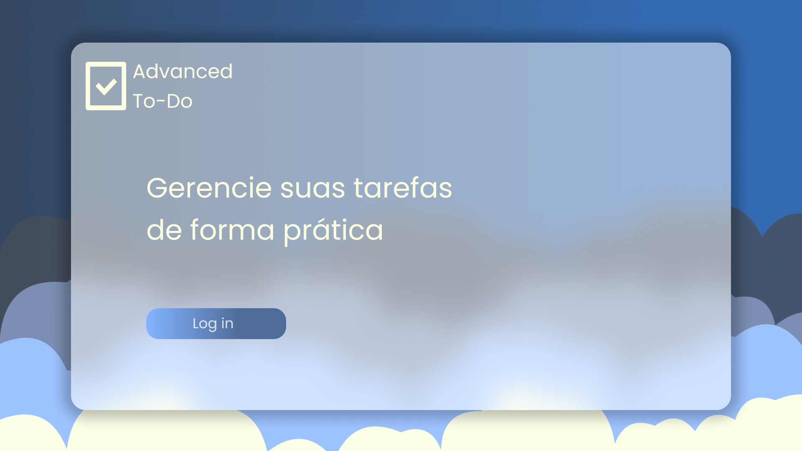
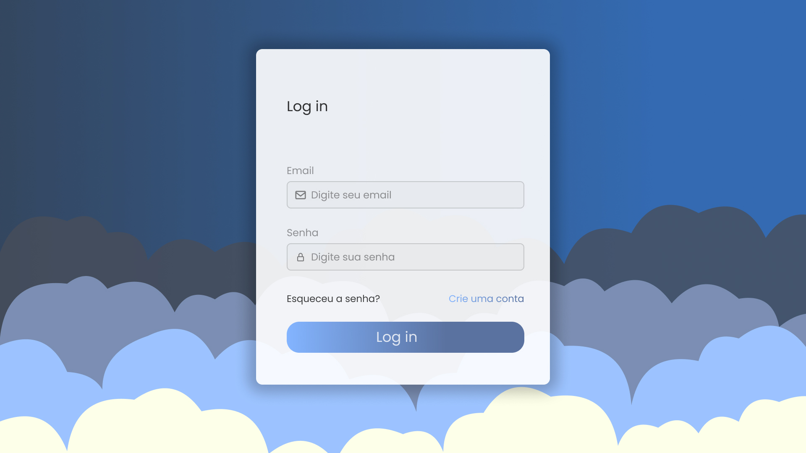
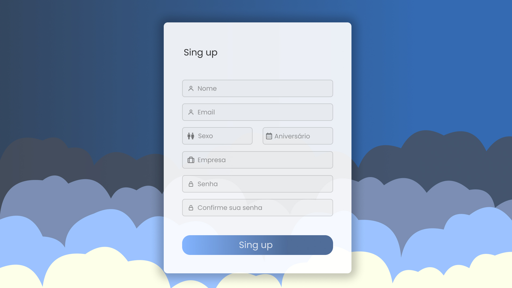
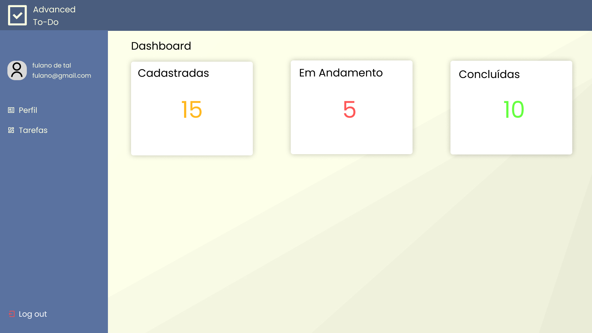
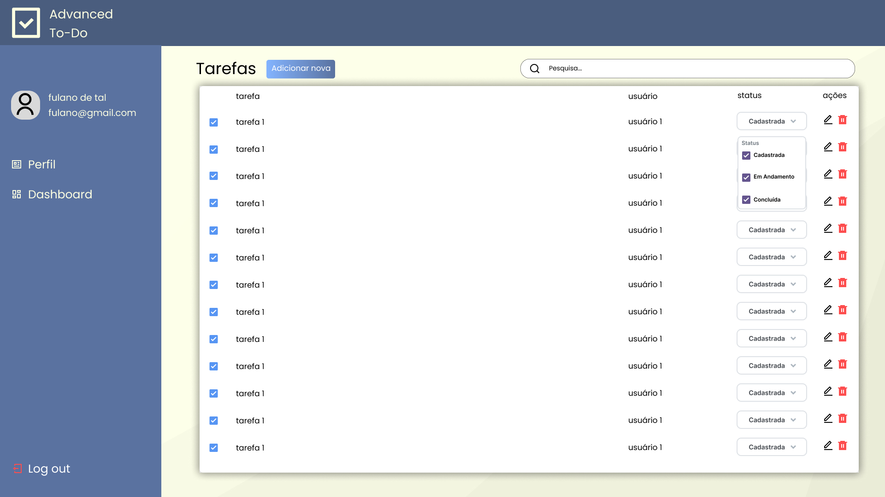
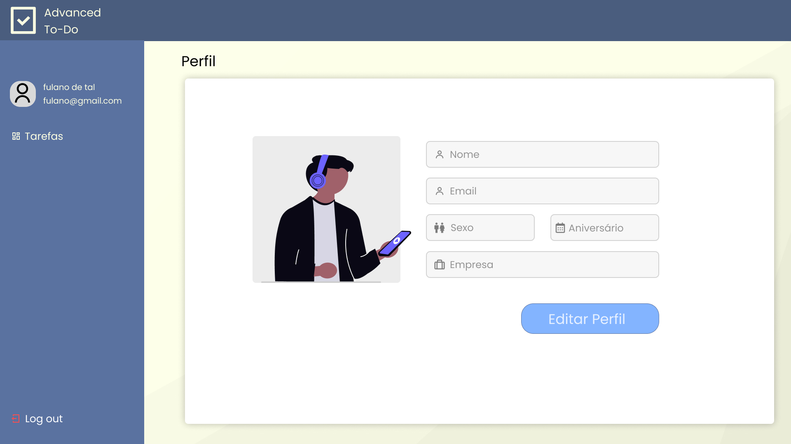

# Advanced ToDo List

## Sumário

- [Descrição do Projeto](#descrição-do-projeto)
- [Protótipos das Telas](#protótipos-das-telas)
- [Link para o Projeto no Figma](#link-para-o-projeto-no-figma)
- [Como Rodar o Projeto](#como-rodar-o-projeto)

---

## Descrição do Projeto

O Advanced To-Do é uma aplicação de lista de tarefas desenvolvida para ajudar os usuários a gerenciar suas tarefas de forma eficiente. A aplicação foi construída utilizando:

- **[Meteor](https://www.meteor.com/)** para infraestrutura de backend e frontend;
- **[React](https://reactjs.org/)** para construção de interfaces;
- **[React Router](https://reactrouter.com/)** para gerenciamento de rotas;
- **[Material-UI](https://mui.com/)** para componentes de interface;
- **MongoDB** como banco de dados (integrado ao Meteor).

### Funcionalidades Principais

- Cadastro e login de usuários
- Criação, listagem, edição e exclusão de tarefas
- Filtro de tarefas por status (Cadastrada, Em Andamento, Concluída)
- Dashboard de estatísticas (tarefas concluidas, etc.)
- Perfil de usuário com foto e dados pessoais

## Protótipos das Telas

> Home
> 

> Tela de login
> 

> Tela de Cadastro
> 

> Dashboard
> 

> Tela de tarefas
> 

> Adicionar tarefas
> 

> Perfil do usuário
> 

---

## Link para o Projeto no Figma

Para uma visão mais detalhada e interativa dos protótipos, acesse o link abaixo:

[Link do Projeto no Figma](https://www.figma.com/design/7xKr9dY03OMEMU3pP1i6HV/Advanced-ToDo?node-id=1-3&t=vf9FkplPjDj9qmlu-1)

---

## Como Rodar o Projeto

1. **Clone o repositório**:

   ```bash
   git clone https://github.com/GabrielFrazz/Advanced-ToDo.git
   ```

2. **Navegue até o diretório do projeto**:

   ```bash
   cd Advanced-ToDo
   ```

3. **Instale as dependências**:

   ```bash
   meteor npm install
   ```

4. **Inicie o servidor**:

   ```bash
   meteor
   ```

5. **Acesse a aplicação**:
   Abra o navegador e vá para `http://localhost:3000`

---
